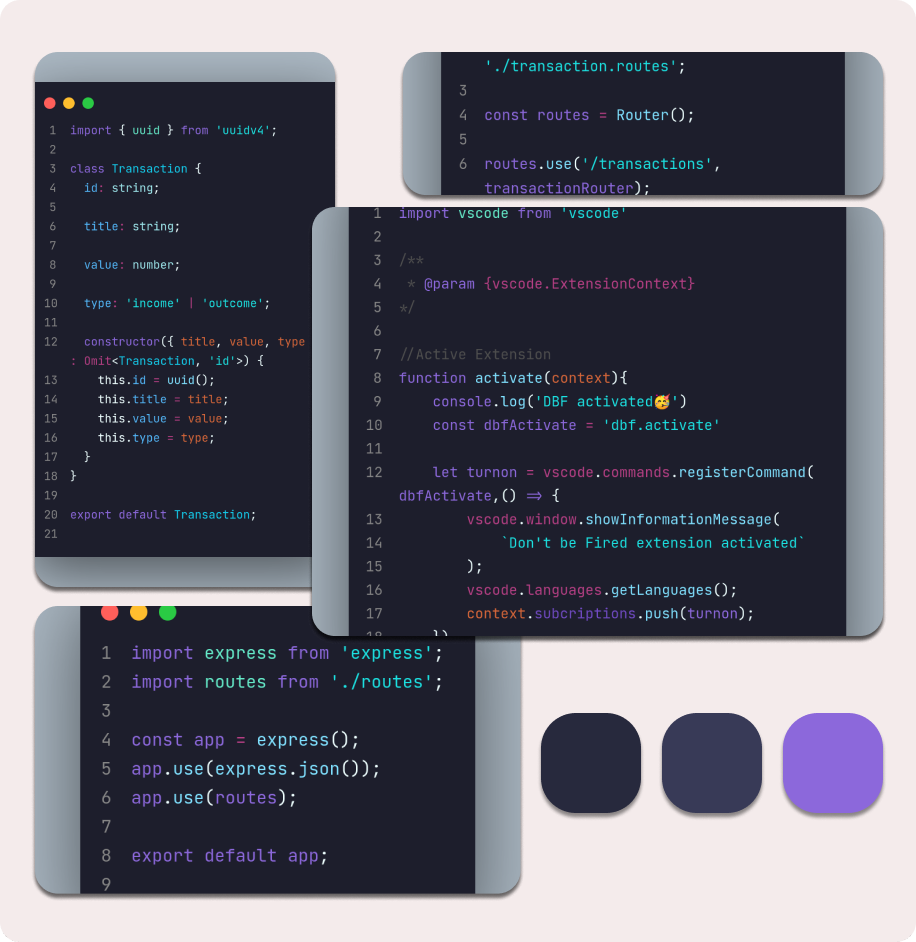

  

  

<h3 align="center">Recommend to use JetBrains Mono Font and Bracket Pair Colorizer 2 Extension.</h3>
 

# Installation
1. Open the **Extensions** sidebar in VS Code
2. Search for [Typing Theme](https://marketplace.visualstudio.com/items?itemName=August.typing-theme)
3. Click **Install**
4. Open the **Command Palette** with `Ctrl+Shift+P`,`⇧⌘P`,  or go to view and click in **Command Palette**
5. Select **Preferences: Color Theme** and choose Typing Theme.

<h1 alingn="center">Preview Image</h1>

  

 
<h1>Theme and Utils<h1>
<table>
  <tr>
    <td valign="top">
     

      
        
      Visual Studio Code
      

    </td>
     <td valign="top">
     

      
        
      JetBrains Mono Font
      

    </td>
     <td valign="top">
     

      
        
      Bracket Pair Colorizer 2
      

    </td>
    </tr>
</table>
  
<h1>Recommendations</h1>
<table>
  <tr>
    <td valign="top">
     

      
        
      Material Theme Icons
      

    </td>
     <td valign="top">
     

      
        
      Colorize
      

    </td>
     <td valign="top">
     

      
        
      Font Switcher
      

    </td>
    </tr>
</table>

# Contributing
Contributions are always welcome.

There's a bunch of ways you can contribute to this project, like by:
- Making a port of this theme for another apps
- Requesting a port
- Reporting a bug
- Improving this documentation
- Sharing this project and recommending it to your friends
- Supporting this project on Patreon
- Funding an issue on IssueHunt
- Dropping a star on this repository
- Voting on ProductHunt

